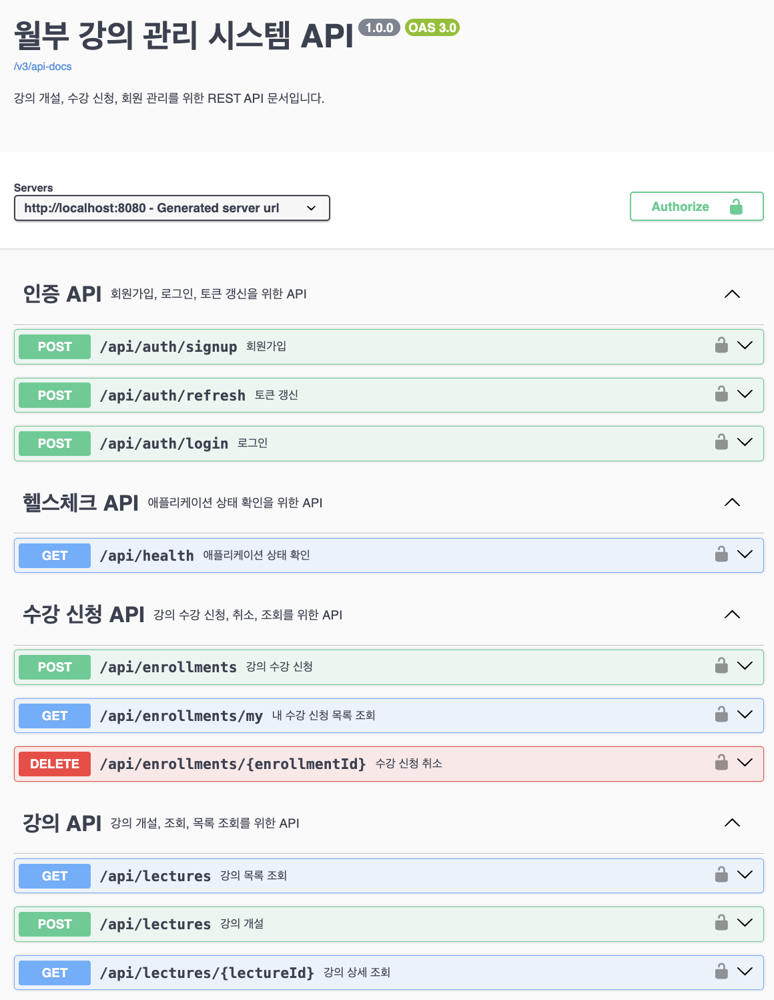

# 📋 API 스펙 문서



## 1. 개요

월부 강의 관리 시스템의 RESTful API 명세서입니다. 이 문서는 모든 API 엔드포인트의 상세한 사용법과 예시를 제공합니다.

### 📖 Swagger UI 사용 권장

이 API의 **실시간 테스트와 상세한 문서**를 위해서는 **Swagger UI**를 사용하는 것을 권장합니다.

- **Swagger UI 접속**: http://localhost:8080/swagger-ui/index.html

> 💡 **팁**: 이 문서의 모든 예시는 Swagger UI에서 실제로 테스트해볼 수 있습니다.

### 기본 정보

- **Base URL**: `http://localhost:8080`
- **API 버전**: v1
- **인증 방식**: JWT Bearer Token
- **응답 형식**: JSON
- **문자 인코딩**: UTF-8

### 공통 응답 형식

모든 API는 다음 표준 응답 형식을 사용합니다:

#### 성공 응답

```json
{
	"success": true,
	"data": {
		// 실제 응답 데이터
	},
	"error": null
}
```

#### 실패 응답

```json
{
	"success": false,
	"data": null,
	"error": {
		"code": "ERROR_CODE",
		"message": "에러 메시지"
	}
}
```

## 2. 인증 API

### 2.1 회원가입

새로운 회원을 등록합니다.

**Endpoint**: `POST /api/auth/signup`

**인증**: 불필요

**요청 본문**:

```json
{
	"name": "홍길동",
	"email": "hong@example.com",
	"phone": "01012345678",
	"password": "Password123!",
	"role": "STUDENT"
}
```

**요청 필드**:

| 필드     | 타입   | 필수 | 설명        | 제약사항                                      |
| -------- | ------ | ---- | ----------- | --------------------------------------------- |
| name     | String | O    | 회원 이름   | 최대 20자                                     |
| email    | String | O    | 이메일 주소 | 유효한 이메일 형식, 최대 100자, 중복 불가     |
| phone    | String | O    | 휴대폰 번호 | 010으로 시작하는 11자리 숫자                  |
| password | String | O    | 비밀번호    | 6~10자, 영문 대소문자와 숫자 중 2종 이상 조합 |
| role     | String | O    | 회원 유형   | STUDENT 또는 INSTRUCTOR                       |

**응답 예시**:

```json
{
	"success": true,
	"data": {
		"id": 1,
		"name": "홍길동",
		"email": "hong@example.com",
		"phone": "01012345678",
		"role": "STUDENT"
	},
	"error": null
}
```

**에러 코드**:

- `400`: 입력값 검증 실패
- `409`: 이미 존재하는 이메일

### 2.2 로그인

이메일과 비밀번호로 로그인합니다.

**Endpoint**: `POST /api/auth/login`

**인증**: 불필요

**요청 본문**:

```json
{
	"email": "hong@example.com",
	"password": "Password123!"
}
```

**요청 필드**:

| 필드     | 타입   | 필수 | 설명        |
| -------- | ------ | ---- | ----------- |
| email    | String | O    | 이메일 주소 |
| password | String | O    | 비밀번호    |

**응답 예시**:

```json
{
	"success": true,
	"data": {
		"accessToken": "eyJhbGciOiJIUzI1NiIsInR5cCI6IkpXVCJ9...",
		"memberId": 1,
		"email": "hong@example.com",
		"role": "STUDENT"
	},
	"error": null
}
```

**쿠키 설정**:

- `refreshToken`: HttpOnly 쿠키로 설정 (만료: 14일)

**에러 코드**:

- `400`: 입력값 검증 실패
- `401`: 이메일 또는 비밀번호 불일치

### 2.3 토큰 갱신

Refresh Token을 사용하여 새로운 Access Token을 발급받습니다.

**Endpoint**: `POST /api/auth/refresh`

**인증**: 불필요 (Refresh Token 쿠키 필요)

**요청 본문**: 없음

**응답 예시**:

```json
{
	"success": true,
	"data": {
		"accessToken": "eyJhbGciOiJIUzI1NiIsInR5cCI6IkpXVCJ9...",
		"memberId": 1,
		"email": "hong@example.com",
		"role": "STUDENT"
	},
	"error": null
}
```

**에러 코드**:

- `400`: Refresh Token 누락
- `401`: 유효하지 않은 Refresh Token

## 3. 강의 API

### 3.1 강의 개설

새로운 강의를 개설합니다.

**Endpoint**: `POST /api/lectures`

**인증**: 필요 (강사 권한)

**요청 헤더**:

```
Authorization: Bearer {accessToken}
```

**요청 본문**:

```json
{
	"title": "Spring Boot 마스터 클래스",
	"maxCapacity": 30,
	"price": 150000
}
```

**요청 필드**:

| 필드        | 타입    | 필수 | 설명           | 제약사항   |
| ----------- | ------- | ---- | -------------- | ---------- |
| title       | String  | O    | 강의명         | 최대 200자 |
| maxCapacity | Integer | O    | 최대 수강 인원 | 1 이상     |
| price       | Integer | O    | 수강료         | 0 이상     |

**응답 예시**:

```json
{
	"success": true,
	"data": {
		"id": 1,
		"title": "Spring Boot 마스터 클래스",
		"maxCapacity": 30,
		"price": 150000,
		"instructorId": 1,
		"instructorName": "김강사",
		"createdAt": "2024-01-15T10:30:00"
	},
	"error": null
}
```

**에러 코드**:

- `400`: 입력값 검증 실패
- `401`: 인증 필요
- `403`: 강사 권한 필요

### 3.2 강의 목록 조회

페이징과 정렬 옵션을 지원하는 강의 목록을 조회합니다.

**Endpoint**: `GET /api/lectures`

**인증**: 불필요

**쿼리 파라미터**:

| 파라미터 | 타입    | 필수 | 기본값 | 설명                     |
| -------- | ------- | ---- | ------ | ------------------------ |
| page     | Integer | X    | 1      | 페이지 번호 (1부터 시작) |
| size     | Integer | X    | 20     | 페이지 크기 (최대 100)   |
| sort     | String  | X    | RECENT | 정렬 방식                |

**정렬 옵션**:

- `RECENT`: 등록일 기준 내림차순 (최신순)
- `POPULAR_COUNT`: 수강신청자 수 기준 내림차순
- `POPULAR_RATE`: 수강신청률 기준 내림차순

**요청 예시**:

```
GET /api/lectures?page=1&size=20&sort=RECENT
```

**응답 예시**:

```json
{
	"success": true,
	"data": {
		"content": [
			{
				"id": 1,
				"title": "Spring Boot 마스터 클래스",
				"maxCapacity": 30,
				"price": 150000,
				"instructorName": "김강사",
				"enrollmentCount": 15,
				"enrollmentRate": 0.5,
				"createdAt": "2024-01-15T10:30:00"
			}
		],
		"pageable": {
			"pageNumber": 0,
			"pageSize": 20,
			"sort": {
				"sorted": true,
				"unsorted": false
			}
		},
		"totalElements": 1,
		"totalPages": 1,
		"first": true,
		"last": true,
		"numberOfElements": 1
	},
	"error": null
}
```

**에러 코드**:

- `400`: 잘못된 파라미터

### 3.3 강의 상세 조회

강의 ID로 특정 강의의 상세 정보를 조회합니다.

**Endpoint**: `GET /api/lectures/{lectureId}`

**인증**: 불필요

**경로 파라미터**:

| 파라미터  | 타입 | 필수 | 설명    |
| --------- | ---- | ---- | ------- |
| lectureId | Long | O    | 강의 ID |

**요청 예시**:

```
GET /api/lectures/1
```

**응답 예시**:

```json
{
	"success": true,
	"data": {
		"id": 1,
		"title": "Spring Boot 마스터 클래스",
		"maxCapacity": 30,
		"price": 150000,
		"instructorId": 1,
		"instructorName": "김강사",
		"createdAt": "2024-01-15T10:30:00"
	},
	"error": null
}
```

**에러 코드**:

- `404`: 강의를 찾을 수 없음

## 4. 수강신청 API

### 4.1 강의 수강 신청

여러 강의를 동시에 신청할 수 있습니다.

**Endpoint**: `POST /api/enrollments`

**인증**: 필요 (수강생 권한)

**요청 헤더**:

```
Authorization: Bearer {accessToken}
```

**요청 본문**:

```json
{
	"lectureIds": [1, 2, 3]
}
```

**요청 필드**:

| 필드       | 타입        | 필수 | 설명                |
| ---------- | ----------- | ---- | ------------------- |
| lectureIds | Array[Long] | O    | 신청할 강의 ID 목록 |

**응답 예시**:

```json
{
	"success": true,
	"data": {
		"successfulEnrollments": [
			{
				"enrollmentId": 1,
				"lectureId": 1,
				"lectureTitle": "Spring Boot 마스터 클래스"
			},
			{
				"enrollmentId": 2,
				"lectureId": 2,
				"lectureTitle": "Java 기초 강의"
			}
		],
		"failedEnrollments": [
			{
				"lectureId": 3,
				"lectureTitle": "React 기초 강의",
				"errorCode": "COURSE_FULL",
				"errorMessage": "정원이 초과되었습니다."
			}
		],
		"totalRequested": 3,
		"successCount": 2,
		"failedCount": 1
	},
	"error": null
}
```

**에러 코드**:

- `400`: 입력값 검증 실패
- `401`: 인증 필요
- `403`: 수강생 권한 필요
- `409`: 정원 초과 또는 중복 신청

### 4.2 내 수강 신청 목록 조회

로그인한 사용자의 수강 신청 목록을 조회합니다.

**Endpoint**: `GET /api/enrollments/my`

**인증**: 필요 (수강생 권한)

**요청 헤더**:

```
Authorization: Bearer {accessToken}
```

**응답 예시**:

```json
{
	"success": true,
	"data": [
		{
			"id": 1,
			"lectureId": 1,
			"lectureTitle": "Spring Boot 마스터 클래스",
			"status": "CONFIRMED",
			"createdAt": "2024-01-15T10:30:00"
		},
		{
			"id": 2,
			"lectureId": 2,
			"lectureTitle": "Java 기초 강의",
			"status": "CANCELED",
			"createdAt": "2024-01-15T11:00:00",
			"canceledAt": "2024-01-15T12:00:00"
		}
	],
	"error": null
}
```

**에러 코드**:

- `401`: 인증 필요
- `403`: 수강생 권한 필요

### 4.3 수강 신청 취소

본인의 수강 신청을 취소합니다.

**Endpoint**: `DELETE /api/enrollments/{enrollmentId}`

**인증**: 필요 (수강생 권한)

**요청 헤더**:

```
Authorization: Bearer {accessToken}
```

**경로 파라미터**:

| 파라미터     | 타입 | 필수 | 설명                |
| ------------ | ---- | ---- | ------------------- |
| enrollmentId | Long | O    | 취소할 수강 신청 ID |

**요청 예시**:

```
DELETE /api/enrollments/1
```

**응답 예시**:

```json
{
	"success": true,
	"data": null,
	"error": null
}
```

**에러 코드**:

- `401`: 인증 필요
- `403`: 수강생 권한 필요 또는 본인 신청이 아님
- `404`: 수강 신청을 찾을 수 없음
- `409`: 이미 취소된 신청

## 5. 헬스체크 API

### 5.1 애플리케이션 상태 확인

애플리케이션의 현재 상태와 버전 정보를 확인합니다.

**Endpoint**: `GET /api/health`

**인증**: 불필요

**응답 예시**:

```json
{
	"success": true,
	"data": {
		"status": "UP",
		"application": "assignment",
		"version": "0.0.1-SNAPSHOT",
		"timestamp": "2024-01-15T10:30:00",
		"message": "Application is running normally"
	},
	"error": null
}
```

## 6. 에러 코드 참조

### 6.1 공통 에러 코드

| HTTP 상태코드 | 에러 코드             | 설명                        |
| ------------- | --------------------- | --------------------------- |
| 400           | VALIDATION_ERROR      | 입력값 검증 실패            |
| 401           | UNAUTHORIZED          | 인증 필요                   |
| 401           | INVALID_CREDENTIALS   | 이메일 또는 비밀번호 불일치 |
| 401           | INVALID_TOKEN         | 유효하지 않은 토큰          |
| 403           | FORBIDDEN             | 권한 없음                   |
| 404           | NOT_FOUND             | 리소스를 찾을 수 없음       |
| 409           | DUPLICATE_EMAIL       | 이미 존재하는 이메일        |
| 409           | COURSE_FULL           | 정원이 초과됨               |
| 409           | ALREADY_ENROLLED      | 이미 신청한 강의            |
| 500           | INTERNAL_SERVER_ERROR | 서버 내부 오류              |

### 6.2 비즈니스 규칙

#### 회원가입 규칙

- 이메일은 중복될 수 없습니다
- 비밀번호는 6~10자이며, 영문 대소문자와 숫자 중 2종 이상 조합이어야 합니다
- 휴대폰 번호는 010으로 시작하는 11자리 숫자여야 합니다

#### 강의 관리 규칙

- 강의 개설은 강사 권한이 필요합니다
- 강의 정원은 1명 이상이어야 합니다
- 수강료는 0원 이상이어야 합니다

#### 수강신청 규칙

- 수강신청은 수강생 권한이 필요합니다
- 정원 초과 시 선착순으로 처리됩니다
- 동일 강의에 대해 활성 상태(CONFIRMED) 신청은 1건만 허용됩니다
- 취소된 강의는 재수강이 가능합니다 (소프트 삭제)

## 7. 인증 및 보안

### 7.1 JWT 토큰

- **Access Token**: API 요청 시 Authorization 헤더에 포함
- **Refresh Token**: HttpOnly 쿠키로 전송
- **토큰 만료**: Access Token 1시간, Refresh Token 14일

### 7.2 권한 관리

- **STUDENT**: 수강신청/취소, 강의 조회
- **INSTRUCTOR**: 강의 개설, 수강신청/취소, 강의 조회

### 7.3 보안 고려사항

- 모든 API 요청은 HTTPS를 권장합니다
- 민감한 정보는 로그에 기록하지 않습니다
- 입력값 검증을 통한 SQL Injection 방지
- JWT 토큰의 안전한 저장 및 전송

## 8. 사용 예시

### 8.1 전체 플로우 예시

```bash
# 1. 회원가입
curl -X POST http://localhost:8080/api/auth/signup \
  -H "Content-Type: application/json" \
  -d '{
    "name": "홍길동",
    "email": "hong@example.com",
    "phone": "01012345678",
    "password": "Password123!",
    "role": "STUDENT"
  }'

# 2. 로그인
curl -X POST http://localhost:8080/api/auth/login \
  -H "Content-Type: application/json" \
  -d '{
    "email": "hong@example.com",
    "password": "Password123!"
  }'

# 3. 강의 목록 조회
curl -X GET "http://localhost:8080/api/lectures?page=1&size=20&sort=RECENT"

# 4. 수강신청
curl -X POST http://localhost:8080/api/enrollments \
  -H "Content-Type: application/json" \
  -H "Authorization: Bearer YOUR_ACCESS_TOKEN" \
  -d '{
    "lectureIds": [1, 2, 3]
  }'

# 5. 내 수강신청 목록 조회
curl -X GET http://localhost:8080/api/enrollments/my \
  -H "Authorization: Bearer YOUR_ACCESS_TOKEN"

# 6. 수강신청 취소
curl -X DELETE http://localhost:8080/api/enrollments/1 \
  -H "Authorization: Bearer YOUR_ACCESS_TOKEN"
```

### 8.2 강사 플로우 예시

```bash
# 1. 강사 회원가입
curl -X POST http://localhost:8080/api/auth/signup \
  -H "Content-Type: application/json" \
  -d '{
    "name": "김강사",
    "email": "instructor@example.com",
    "phone": "01087654321",
    "password": "Instructor123!",
    "role": "INSTRUCTOR"
  }'

# 2. 로그인
curl -X POST http://localhost:8080/api/auth/login \
  -H "Content-Type: application/json" \
  -d '{
    "email": "instructor@example.com",
    "password": "Instructor123!"
  }'

# 3. 강의 개설
curl -X POST http://localhost:8080/api/lectures \
  -H "Content-Type: application/json" \
  -H "Authorization: Bearer YOUR_ACCESS_TOKEN" \
  -d '{
    "title": "Spring Boot 마스터 클래스",
    "maxCapacity": 30,
    "price": 150000
  }'
```

## 9. 추가 정보

- **API 문서**: 애플리케이션 실행 후 http://localhost:8080/swagger-ui/index.html
- **프로젝트 README**: [README.md](../README.md)
- **아키텍처 문서**: [architecture.md](architecture.md)
